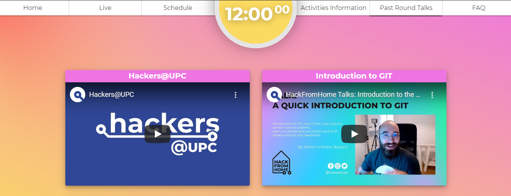

# HackFromHome Live

[](https://app.netlify.com/sites/hackfromhome-live/deploys)
[](https://travis-ci.com/hackupc/hackfromhome-live)



Hi! This is the code of the HackFromHome live page, it was changed for all the rounds!

## Setup

Install the latest version Node.js (at least v12.6.0). [Find how here](https://nodejs.org/en/download/package-manager/).

```sh
sudo npm cache clean -f
sudo npm install -g n
sudo n latest
```

```sh
git clone git@github.com:hackupc/hackupc-live.git
cd hackupc-live
npm install
```

## Develop

Use `npm run serve` to compile and serve the dist directory in real time. Then view the website at [https://localhost:8080](https://localhost:8080)

**Install linters** extensions in your favorite editor. In VS Code install: `HTMLHint`, `TSLint`, `markdownlint`, `StandardJS`, `stylelint` and `npm`. In other editors they may have similar names.
Or use `npm run lint` to run linters manually from the console to check errors.

We use linters to ensure code quality, please fix all the errors.

Because of cahe busting you may have to clean the cache when you reload to see changes. In Chrome you can do `Ctrl` + `F5`.

**TLDR;**

Run this:

```sh
npm run serve
```

View the website at [https://localhost:8080](https://localhost:8080)

## General info

The html and .sass files are a bit outdated, so you may want to refactor them to CSS :D .

## Deploy

### Deploy to localhost

Use `npm run build` to compile all dist directory.
The files will be compiled to `/dist/`. Notice that the routes change, so when referencing files check where they are in [/dist/](/dist/]).

Use `serve -s dist` to just serve `/dist` at [https://localhost:5000](https://localhost:5000).

**TLDR;**

Run this:

```sh
npm run build
serve -s dist
```

View the website at [https://localhost:5000](https://localhost:5000).

### Deploy to production

**Push to master**. [Netlify](https://app.netlify.com/sites/hackfromhome-live) will build and deploy automatically.

If you push something that doesn't build, don't worry, it won't be published.

## Live

Features included

- Optional subscription to events - 5 minutes before notifications
- Schedule live reload
- Fancy schedule with time padding
- Normal tabular schedule
- Countdown
- Full-screen mode by pressing `p`

### Config

Some parameters (offsets, timeouts, defaults) can be changed in `src/config.js`. Keep in mind that some values are just constants and should not be changed.
Here you can edit the `FAKE_DATE` parameter to test funtionalities.

## Edit content

### Change theme

> TODO: fill this part

### Update schedule

> TODO: polish this part

Clients will poll constantly the schedule.json file. To update the schedule just change the file and deploy.  
New versions of the schedule will be loaded only if 'version' is different.

#### Schedule file

- `id` can be whatever you want, but all ids must be different  
- When writing hours, prepend zeroes: Nice: 01:00; Not-so-nice: 1:00.  
- Events should be ordered by starting hour  
- `baseTimeOffset` should be the same output as executing (new Date()).getTimezoneOffset() in a machine with local time. (UTC - localtime in minutes)  
- `dates` are DD/MM/YYYY format  

> If an event doesn't have endHour, then will show only startHour and it will finish at the same time as it starts.  
Useful to specify events that don't have concept of length or that span through more than one day ("Event start", "Event end")

## Support

If you need help understanding something of this repo you can ask the previous developer. The ones that made this version of live is:

- Carlota Catot Bragós: Slack `@Carlota` [carlotacb.dev](https://www.carlotacb.dev/)

This side is a fork from 2019 HackUPC live that was developed by:

- Maurici Abad Gutierrez: Slack `@mauriciabad` [mauriciabad.com](https://mauriciabad.com/)
- Bernat Torres: Slack `@bernatixer` [bernattorres.com](https://bernattorres.com/)

## License

MIT © Hackers@UPC
